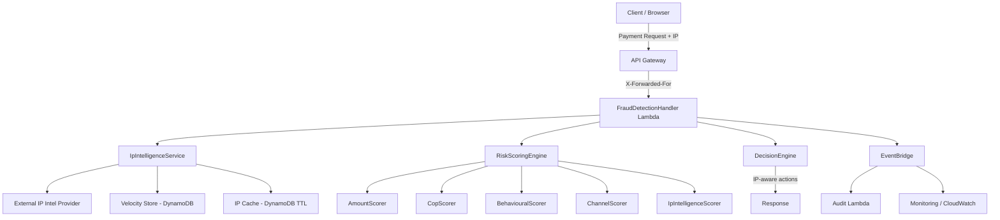
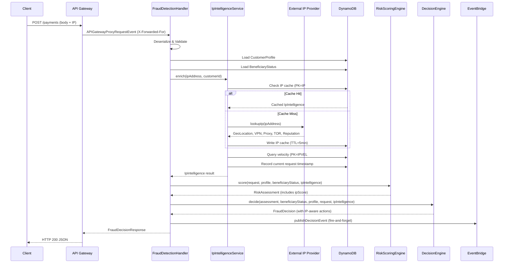
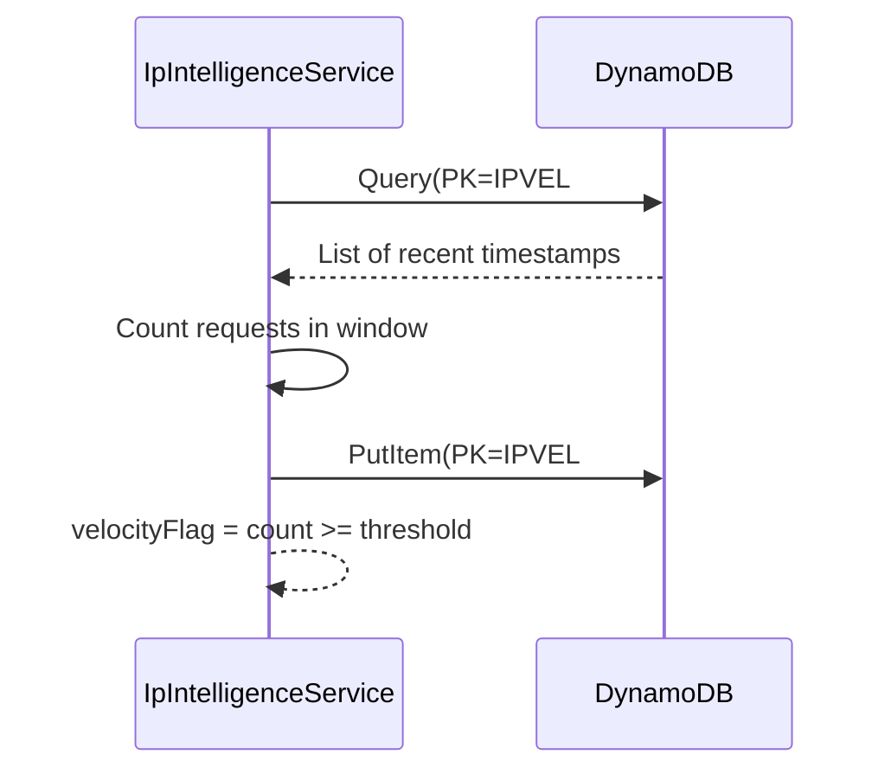

# Design Document: Device IP Address Intelligence

## Overview

The Device IP Address Intelligence feature extends the Payment Fraud Detection system with network-layer risk signals derived from the originating IP address of each transaction. It introduces a new `IpIntelligenceScorer` component that evaluates VPN/proxy/TOR usage, geolocation anomalies, IP reputation, and velocity patterns to produce a score in [0, 25] that integrates into the existing composite risk scoring pipeline.

The feature adds an `IpIntelligenceService` that enriches every payment request with IP intelligence attributes (geolocation, anonymizer detection, reputation score, velocity flags) by combining an external IP intelligence provider lookup with internal velocity tracking via DynamoDB. The enriched data feeds the new scorer, and the `DecisionEngine` gains IP-aware action rules (step-up authentication for VPN + high-value, block for TOR, throttle for velocity spikes). All processing must complete within the existing 280ms scoring timeout budget.

## Architecture



The architecture extends the existing Lambda-based fraud detection flow by inserting the `IpIntelligenceService` as an enrichment step before scoring. The service runs in-process within the same Lambda invocation (not a separate Lambda) to avoid cross-Lambda latency. IP intelligence results are cached in DynamoDB with a TTL to reduce external API calls for repeated IPs within a short window.

## Sequence Diagrams

### Main Flow: Payment with IP Intelligence Enrichment



### Velocity Detection Sub-Flow



## Components and Interfaces

### Component 1: IpIntelligenceService

**Purpose**: Enriches a transaction with IP intelligence attributes by coordinating external lookups, caching, and velocity detection.

**Interface**:
```java
public interface IpIntelligenceService {
    /**
     * Enriches a transaction with IP intelligence data.
     * Performs geo-lookup, anonymizer detection, reputation scoring,
     * and velocity detection for the given IP address.
     *
     * @param ipAddress  the source IP address from the request
     * @param customerId the customer identifier (sortCode + accountNumber)
     * @return IpIntelligence enrichment result
     */
    IpIntelligence enrich(String ipAddress, String customerId);
}
```

**Responsibilities**:
- Check DynamoDB cache for recent IP lookups (TTL-based, 5 minute window)
- Call external IP intelligence provider on cache miss
- Track IP request velocity in DynamoDB
- Determine if IP is new/unseen for the customer
- Assemble and return the complete IpIntelligence object

### Component 2: IpIntelligenceScorer

**Purpose**: Converts IP intelligence attributes into a risk score in [0, 25] following the `ComponentScorer` pattern.

**Interface**:
```java
public class IpIntelligenceScorer implements ComponentScorer {
    /**
     * Scores IP-based risk factors for a payment request.
     * Evaluates VPN/proxy, TOR, high-risk geo, reputation, velocity, and new IP signals.
     *
     * @param request the payment request
     * @param profile the customer profile
     * @param ipIntelligence the enriched IP data
     * @return ScorerResult with score [0, 25] and explanation
     */
    public ScorerResult score(FasterPaymentRequest request, 
                              CustomerProfile profile, 
                              IpIntelligence ipIntelligence);
}
```

**Responsibilities**:
- Apply scoring rules: VPN/Proxy (+25), TOR (+40), High-risk geo (+20), Reputation >70 (+30), Velocity (+20), New IP (+15)
- Normalize raw IP score from [0, 150] range down to [0, 25] using: `normalizedScore = min(25, rawScore * 25 / 150)`
- Collect risk factor explanations for audit trail
- Cap final score at 25 to maintain existing composite score range [0, 125]

### Component 3: IpIntelligenceProvider (External)

**Purpose**: Abstracts the external IP intelligence API call for geolocation, anonymizer detection, and reputation scoring.

**Interface**:
```java
public interface IpIntelligenceProvider {
    /**
     * Looks up IP intelligence data from an external provider.
     * Must complete within 100ms timeout.
     *
     * @param ipAddress the IP to look up
     * @return IpLookupResult with geo, anonymizer, and reputation data
     */
    IpLookupResult lookup(String ipAddress);
}
```

**Responsibilities**:
- HTTP call to external IP intelligence API (e.g., IPQualityScore, MaxMind, ip-api)
- Parse response into normalized internal model
- Handle timeouts gracefully (return degraded result with unknown flags)
- Circuit breaker pattern to avoid cascading failures

### Component 4: IpVelocityTracker

**Purpose**: Tracks request frequency per IP address using DynamoDB with TTL-based expiry.

**Interface**:
```java
public interface IpVelocityTracker {
    /**
     * Records a request from an IP and returns the velocity count
     * in the configured time window.
     *
     * @param ipAddress the source IP address
     * @param windowSeconds the lookback window in seconds (default 300)
     * @return VelocityResult with count and flag
     */
    VelocityResult recordAndCount(String ipAddress, int windowSeconds);
}
```

**Responsibilities**:
- Write current timestamp entry to DynamoDB (PK=IPVEL#{ip}, SK=TSTAMP#{epoch})
- Query recent entries within the time window
- Set TTL on entries for automatic cleanup
- Return count and boolean flag (exceeds threshold)

### Component 5: HighRiskGeoRegistry

**Purpose**: Maintains the set of high-risk country codes for geolocation checks.

**Interface**:
```java
public interface HighRiskGeoRegistry {
    /**
     * Checks if a country code is classified as high-risk.
     * 
     * @param countryCode ISO 3166-1 alpha-2 country code
     * @return true if the country is high-risk
     */
    boolean isHighRisk(String countryCode);
}
```

**Responsibilities**:
- Load high-risk country list from configuration (environment variable or DynamoDB)
- Provide O(1) lookup for country risk classification
- Support runtime updates without redeployment

## Data Models

### Model 1: IpIntelligence

```java
public record IpIntelligence(
    String ipAddress,
    String country,
    String region,
    boolean isVpn,
    boolean isProxy,
    boolean isTor,
    int ipReputationScore,      // 0-100, higher = more risky
    boolean isHighRiskGeo,
    boolean velocityFlag,
    boolean isNewIp,            // not seen before for this customer
    Instant lastSeenTimestamp
) {}
```

**Validation Rules**:
- `ipAddress` must be a valid IPv4 or IPv6 address (non-null, non-empty)
- `country` must be ISO 3166-1 alpha-2 (2 characters) or null if unknown
- `ipReputationScore` must be in range [0, 100]
- `lastSeenTimestamp` must not be in the future

### Model 2: IpLookupResult (from external provider)

```java
public record IpLookupResult(
    String country,
    String region,
    double latitude,
    double longitude,
    boolean isVpn,
    boolean isProxy,
    boolean isTor,
    int reputationScore,
    boolean success           // false if lookup failed/timed out
) {}
```

### Model 3: VelocityResult

```java
public record VelocityResult(
    int requestCount,
    int windowSeconds,
    boolean velocityFlag,     // requestCount >= threshold
    Instant oldestInWindow,
    Instant newestInWindow
) {}
```

### Model 4: Updated RiskAssessment (extended)

```java
public record RiskAssessment(
    int riskScore,
    int amountScore,
    int copScore,
    int behaviouralScore,
    int channelScore,
    int ipScore,              // NEW: IP intelligence score [0, 25]
    List<RiskFactor> riskFactors
) {}
```

### Model 5: Updated RiskBreakdown (extended)

```java
public record RiskBreakdown(
    int amountScore,
    int copScore,
    int behaviouralScore,
    int channelScore,
    int ipScore               // NEW: IP intelligence score component
) {}
```

### Model 6: DynamoDB Entity - IP Cache

```
PK: IP#<ipAddress>
SK: CACHE
TTL: current_epoch + 300 (5 minutes)
Attributes:
  - country: String
  - region: String
  - isVpn: Boolean
  - isProxy: Boolean  
  - isTor: Boolean
  - reputationScore: Number
  - cachedAt: String (ISO-8601)
```

### Model 7: DynamoDB Entity - IP Velocity

```
PK: IPVEL#<ipAddress>
SK: TSTAMP#<epochMillis>
TTL: current_epoch + 300 (5 minutes)
Attributes:
  - customerId: String
  - messageId: String
```

### Model 8: DynamoDB Entity - Customer Known IPs

```
PK: PROFILE#<sortCode>#<accountNumber>
SK: KNOWNIP#<ipAddress>
Attributes:
  - firstSeen: String (ISO-8601)
  - lastSeen: String (ISO-8601)
  - useCount: Number
```

## Algorithmic Pseudocode

### Algorithm 1: IP Intelligence Enrichment

```java
/**
 * ALGORITHM: enrichIpIntelligence
 * INPUT: ipAddress (String), customerId (String)
 * OUTPUT: IpIntelligence
 */
public IpIntelligence enrich(String ipAddress, String customerId) {
    // Step 1: Check cache
    Optional<IpLookupResult> cached = ipCacheRepository.get(ipAddress);
    
    IpLookupResult lookupResult;
    if (cached.isPresent()) {
        lookupResult = cached.get();
    } else {
        // Step 2: External lookup with timeout
        lookupResult = ipProvider.lookup(ipAddress); // 100ms timeout
        if (lookupResult.success()) {
            ipCacheRepository.put(ipAddress, lookupResult, Duration.ofMinutes(5));
        }
    }
    
    // Step 3: Velocity detection
    VelocityResult velocity = velocityTracker.recordAndCount(ipAddress, 300);
    
    // Step 4: Check if IP is new for customer
    boolean isNewIp = !customerIpRepository.hasSeenIp(customerId, ipAddress);
    if (!isNewIp) {
        customerIpRepository.updateLastSeen(customerId, ipAddress);
    } else {
        customerIpRepository.recordNewIp(customerId, ipAddress);
    }
    
    // Step 5: High-risk geo check
    boolean isHighRiskGeo = highRiskGeoRegistry.isHighRisk(lookupResult.country());
    
    // Step 6: Assemble result
    return new IpIntelligence(
        ipAddress,
        lookupResult.country(),
        lookupResult.region(),
        lookupResult.isVpn(),
        lookupResult.isProxy(),
        lookupResult.isTor(),
        lookupResult.reputationScore(),
        isHighRiskGeo,
        velocity.velocityFlag(),
        isNewIp,
        Instant.now()
    );
}
```

### Algorithm 2: IP Risk Scoring

```java
/**
 * ALGORITHM: scoreIpRisk
 * INPUT: ipIntelligence (IpIntelligence)
 * OUTPUT: ScorerResult with score in [0, 25]
 * 
 * Raw scoring signals (can exceed 25 in combination):
 *   VPN/Proxy: +25, TOR: +40, High-risk geo: +20, 
 *   Reputation >70: +30, Velocity: +20, New IP: +15
 * 
 * Maximum raw total: 150
 * Normalization: normalizedScore = min(25, rawScore * 25 / 150)
 */
public ScorerResult score(FasterPaymentRequest request, 
                          CustomerProfile profile,
                          IpIntelligence ipIntelligence) {
    
    if (ipIntelligence == null) {
        return new ScorerResult(0, "IP intelligence unavailable");
    }
    
    int rawScore = 0;
    List<String> factors = new ArrayList<>();
    
    // Signal 1: VPN or Proxy detected
    if (ipIntelligence.isVpn() || ipIntelligence.isProxy()) {
        rawScore += 25;
        factors.add(ipIntelligence.isVpn() ? "VPN_DETECTED" : "PROXY_DETECTED");
    }
    
    // Signal 2: TOR usage (additive, not exclusive with VPN)
    if (ipIntelligence.isTor()) {
        rawScore += 40;
        factors.add("TOR_DETECTED");
    }
    
    // Signal 3: High-risk geography
    if (ipIntelligence.isHighRiskGeo()) {
        rawScore += 20;
        factors.add("HIGH_RISK_GEO");
    }
    
    // Signal 4: IP reputation above threshold
    if (ipIntelligence.ipReputationScore() > 70) {
        rawScore += 30;
        factors.add("HIGH_REPUTATION_RISK");
    }
    
    // Signal 5: Velocity anomaly
    if (ipIntelligence.velocityFlag()) {
        rawScore += 20;
        factors.add("VELOCITY_ANOMALY");
    }
    
    // Signal 6: New/unseen IP for this customer
    if (ipIntelligence.isNewIp()) {
        rawScore += 15;
        factors.add("NEW_IP");
    }
    
    // Normalize raw score [0, 150] to [0, 25]
    int normalizedScore = Math.min(25, (rawScore * 25) / 150);
    
    String explanation = buildExplanation(normalizedScore, rawScore, factors);
    return new ScorerResult(normalizedScore, explanation);
}
```

### Algorithm 3: Velocity Detection

```java
/**
 * ALGORITHM: recordAndCountVelocity
 * INPUT: ipAddress (String), windowSeconds (int)
 * OUTPUT: VelocityResult
 * 
 * Uses DynamoDB Query with key condition on PK and SK range
 * to count requests in the time window.
 * Default threshold: 5 requests per 5 minutes per IP.
 */
public VelocityResult recordAndCount(String ipAddress, int windowSeconds) {
    Instant now = Instant.now();
    Instant windowStart = now.minusSeconds(windowSeconds);
    
    String pk = "IPVEL#" + ipAddress;
    String skStart = "TSTAMP#" + windowStart.toEpochMilli();
    String skEnd = "TSTAMP#" + now.toEpochMilli();
    
    // Record this request
    long ttl = now.getEpochSecond() + windowSeconds;
    putVelocityEntry(pk, "TSTAMP#" + now.toEpochMilli(), ttl);
    
    // Query for all entries in window
    List<Long> timestamps = queryVelocityEntries(pk, skStart, skEnd);
    
    int count = timestamps.size();
    boolean velocityFlag = count >= VELOCITY_THRESHOLD; // default: 5
    
    return new VelocityResult(
        count,
        windowSeconds,
        velocityFlag,
        Instant.ofEpochMilli(timestamps.isEmpty() ? 0 : timestamps.get(0)),
        now
    );
}
```

### Algorithm 4: IP-Aware Decision Enhancement

```java
/**
 * ALGORITHM: applyIpDecisionRules
 * INPUT: baseDecision (Decision), ipIntelligence (IpIntelligence), 
 *        request (FasterPaymentRequest)
 * OUTPUT: Enhanced FraudDecision with IP-aware actions
 * 
 * Rules applied AFTER base decision logic:
 *   1. VPN + high-value (>£1000) → Step-up authentication
 *   2. TOR usage → Block or manual review
 *   3. High-risk geo + new payee → Delay + warning
 *   4. Velocity spike → Temporary throttle
 */
public FraudDecision applyIpDecisionRules(Decision baseDecision,
                                           IpIntelligence ipIntelligence,
                                           FasterPaymentRequest request,
                                           BeneficiaryStatus beneficiaryStatus) {
    
    if (ipIntelligence == null) {
        return baseDecision; // No IP data, no enhancement
    }
    
    List<StepUpAction> actions = new ArrayList<>();
    Decision enhanced = baseDecision;
    
    // Rule 1: VPN + high-value payment → Step-up
    if ((ipIntelligence.isVpn() || ipIntelligence.isProxy()) 
            && request.amount().compareTo(HIGH_VALUE_THRESHOLD) > 0) {
        actions.add(new StepUpAction(StepUpType.AUTHENTICATION, "VPN detected with high-value payment"));
        enhanced = elevateDecision(enhanced, Decision.REVIEW);
    }
    
    // Rule 2: TOR → Block or manual review
    if (ipIntelligence.isTor()) {
        enhanced = elevateDecision(enhanced, Decision.BLOCK);
        actions.add(new StepUpAction(StepUpType.MANUAL_REVIEW, "TOR network usage detected"));
    }
    
    // Rule 3: High-risk geo + new payee → Delay
    if (ipIntelligence.isHighRiskGeo() && isNewPayee(beneficiaryStatus)) {
        actions.add(new StepUpAction(StepUpType.DELAY, "High-risk geography with new payee"));
        enhanced = elevateDecision(enhanced, Decision.REVIEW);
    }
    
    // Rule 4: Velocity spike → Throttle
    if (ipIntelligence.velocityFlag()) {
        actions.add(new StepUpAction(StepUpType.THROTTLE, "IP velocity spike detected"));
        enhanced = elevateDecision(enhanced, Decision.REVIEW);
    }
    
    return enhanced;
}

private Decision elevateDecision(Decision current, Decision minimum) {
    // ALLOW < REVIEW < BLOCK
    if (current.ordinal() < minimum.ordinal()) {
        return minimum;
    }
    return current;
}
```

## Key Functions with Formal Specifications

### Function 1: IpIntelligenceService.enrich()

```java
IpIntelligence enrich(String ipAddress, String customerId)
```

**Preconditions:**
- `ipAddress` is non-null, non-empty, and a valid IPv4 or IPv6 address
- `customerId` is non-null and non-empty (format: sortCode + accountNumber)
- External IP provider is configured and reachable (degraded mode if unavailable)

**Postconditions:**
- Returns a non-null `IpIntelligence` object
- `result.ipAddress()` equals the input `ipAddress`
- `result.ipReputationScore()` is in range [0, 100]
- If external lookup fails, returns degraded result with `isVpn=false, isProxy=false, isTor=false, reputationScore=0`
- Velocity entry is always recorded regardless of external lookup success
- Total execution time ≤ 150ms (100ms external timeout + 50ms DynamoDB operations)

**Loop Invariants:** N/A (no loops in main flow)

### Function 2: IpIntelligenceScorer.score()

```java
ScorerResult score(FasterPaymentRequest request, CustomerProfile profile, IpIntelligence ipIntelligence)
```

**Preconditions:**
- `request` is non-null and validated
- `profile` is non-null (may be default profile for new customers)
- `ipIntelligence` may be null (graceful degradation)

**Postconditions:**
- Returns non-null `ScorerResult`
- `result.score()` is in range [0, 25]
- If `ipIntelligence` is null, returns score of 0
- Score is monotonically non-decreasing as risk signals increase (adding a risk signal never decreases score)
- `result.explanation()` is non-null, non-empty, and ≤ 200 characters

**Loop Invariants:**
- During factor accumulation: `rawScore >= 0` and each signal adds a non-negative amount
- After normalization: `0 <= normalizedScore <= 25`

### Function 3: IpVelocityTracker.recordAndCount()

```java
VelocityResult recordAndCount(String ipAddress, int windowSeconds)
```

**Preconditions:**
- `ipAddress` is non-null and non-empty
- `windowSeconds` > 0 (typically 300)

**Postconditions:**
- A new entry is written to DynamoDB with TTL = now + windowSeconds
- `result.requestCount()` >= 1 (current request is always counted)
- `result.velocityFlag()` == (`result.requestCount()` >= VELOCITY_THRESHOLD)
- `result.windowSeconds()` equals input `windowSeconds`
- Entries older than windowSeconds are excluded from count (handled by query range)

**Loop Invariants:** N/A

### Function 4: RiskScoringEngine.score() (updated)

```java
RiskAssessment score(FasterPaymentRequest request, CustomerProfile profile, 
                     BeneficiaryStatus beneficiaryStatus, IpIntelligence ipIntelligence)
```

**Preconditions:**
- All inputs non-null (ipIntelligence may be null for graceful degradation)
- Each component scorer is initialized

**Postconditions:**
- `result.riskScore()` == sum of all 5 component scores
- `result.riskScore()` is in range [0, 125] (5 scorers × 25 max each)
- Each component score is in [0, 25]
- `result.riskFactors()` contains an entry for every scorer with score > 0
- Order of risk factors matches: amount, cop, behavioural, channel, ip

**Loop Invariants:** N/A

## Example Usage

```java
// Example 1: Full enrichment and scoring flow
String ipAddress = extractIpAddress(apiGatewayEvent); // from X-Forwarded-For
String customerId = request.debtorAccount().sortCode() + request.debtorAccount().accountNumber();

IpIntelligence ipIntelligence = ipIntelligenceService.enrich(ipAddress, customerId);

// Score with IP intelligence
RiskAssessment assessment = riskScoringEngine.score(request, profile, beneficiaryStatus, ipIntelligence);

// Decision with IP-aware rules
FraudDecision decision = decisionEngine.decide(assessment, beneficiaryStatus, profile, request, ipIntelligence);

// Example 2: Handling missing IP (e.g., internal request)
String ipAddress = extractIpAddress(apiGatewayEvent);
IpIntelligence ipIntelligence = null;
if (ipAddress != null && !ipAddress.isBlank()) {
    ipIntelligence = ipIntelligenceService.enrich(ipAddress, customerId);
}
// Scorer handles null gracefully, returns 0

// Example 3: IP extraction from API Gateway headers
private String extractIpAddress(APIGatewayProxyRequestEvent event) {
    Map<String, String> headers = event.getHeaders();
    if (headers == null) return null;
    
    // X-Forwarded-For may contain comma-separated list; take first (client IP)
    String xff = headers.get("X-Forwarded-For");
    if (xff != null && !xff.isBlank()) {
        return xff.split(",")[0].trim();
    }
    
    // Fallback to source IP from request context
    var ctx = event.getRequestContext();
    if (ctx != null && ctx.getIdentity() != null) {
        return ctx.getIdentity().getSourceIp();
    }
    return null;
}

// Example 4: Response with IP risk breakdown
{
    "messageId": "msg-12345",
    "decision": "REVIEW",
    "riskScore": 62,
    "breakdown": {
        "amountScore": 10,
        "copScore": 5,
        "behaviouralScore": 12,
        "channelScore": 15,
        "ipScore": 20
    },
    "riskFactors": [
        {"category": "ip", "explanation": "IP risk (score=20, raw=120): VPN_DETECTED, HIGH_RISK_GEO, VELOCITY_ANOMALY"},
        {"category": "channel", "explanation": "Channel risk (score=15): unknown device, location >50km"},
        {"category": "behavioural", "explanation": "Behavioural risk (score=12): unusual session duration"}
    ],
    "timestamp": "2024-01-15T10:30:00Z"
}
```

## Correctness Properties

### Property 1: Score Boundedness
For all IpIntelligence inputs, `0 <= ipScore <= 25`

### Property 2: Score Monotonicity
Adding a risk signal to IpIntelligence never decreases the normalized score

### Property 3: Null Safety
When ipIntelligence is null, ipScore == 0 and no IP risk factors are emitted

### Property 4: Composite Score Range
With 5 scorers, total riskScore is in [0, 125]; DecisionEngine must handle scores > 100

### Property 5: Velocity Consistency
After `recordAndCount`, the returned count always includes the current request (count >= 1)

### Property 6: Cache Idempotency
Multiple calls with the same IP within TTL window return equivalent results (modulo velocity count)

### Property 7: Decision Elevation Only
IP decision rules can only elevate decisions (ALLOW→REVIEW, REVIEW→BLOCK), never downgrade

### Property 8: TOR Always Blocks
If `isTor == true`, the final decision must be BLOCK regardless of other signals

### Property 9: Timeout Graceful Degradation
If external IP lookup exceeds 100ms, the system returns a valid (degraded) IpIntelligence with all flags false and reputation 0

### Property 10: Audit Completeness
Every IP risk indicator that contributes to score must appear in riskFactors list

## Error Handling

### Error Scenario 1: External IP Provider Timeout

**Condition**: External IP lookup exceeds 100ms timeout
**Response**: Return degraded `IpLookupResult` with `success=false`, all anonymizer flags false, reputation=0
**Recovery**: Next request for same IP will retry the external lookup (no failed result is cached)
**Impact**: IP score will only reflect velocity and new-IP signals (reduced but non-zero protection)

### Error Scenario 2: DynamoDB Velocity Write Failure

**Condition**: PutItem for velocity entry fails (throttled or network error)
**Response**: Log warning, proceed with velocity count from query only (may undercount by 1)
**Recovery**: Automatic - next request will succeed. TTL-based cleanup prevents stale data accumulation
**Impact**: Velocity flag may be slightly underreported for one request

### Error Scenario 3: Invalid IP Address Format

**Condition**: `X-Forwarded-For` header contains malformed IP or is missing
**Response**: Skip IP enrichment entirely, pass null to scorer (which returns 0)
**Recovery**: No recovery needed - transaction proceeds with reduced IP intelligence
**Impact**: Zero IP score contribution; other 4 scorers still provide protection

### Error Scenario 4: Cache Corruption

**Condition**: Cached IP lookup result has invalid/corrupted data
**Response**: Delete corrupted cache entry, perform fresh external lookup
**Recovery**: Fresh lookup repopulates cache with valid data
**Impact**: One request incurs external lookup latency instead of cache hit

### Error Scenario 5: Circuit Breaker Open (External Provider Down)

**Condition**: External provider has exceeded failure threshold (e.g., 5 failures in 60s)
**Response**: Immediately return degraded result without attempting external call
**Recovery**: Circuit breaker half-opens after cooldown period (30s), allows probe request
**Impact**: All requests during open state get degraded IP intelligence (velocity + new-IP only)

## Testing Strategy

### Unit Testing Approach

Test each component in isolation with mocked dependencies:

- **IpIntelligenceScorer**: Test all signal combinations, verify score bounds [0, 25], null handling, normalization correctness
- **IpIntelligenceService**: Mock external provider and DynamoDB; verify cache hit/miss paths, velocity recording, new IP detection
- **IpVelocityTracker**: Mock DynamoDB; verify count accuracy, threshold logic, TTL setting
- **DecisionEngine (IP rules)**: Test each IP decision rule independently and in combination; verify elevation-only property
- **IP extraction**: Test X-Forwarded-For parsing with single IP, multiple IPs, IPv6, missing header

Key test cases:
- All signals active → max raw score (150) normalizes to 25
- No signals active → score is 0
- TOR alone → normalized score is ceil(40 * 25 / 150) = 7
- VPN + reputation + velocity → normalized score is min(25, (25+30+20) * 25 / 150) = 12
- Null IpIntelligence → score 0, no risk factors

### Property-Based Testing Approach

**Property Test Library**: jqwik (already in project)

Properties to test with jqwik:
1. **Boundedness**: For any arbitrary `IpIntelligence`, score is always in [0, 25]
2. **Monotonicity**: Setting any boolean flag from false→true never decreases the score
3. **Normalization correctness**: `normalizedScore <= 25` for all possible raw score values [0, 150]
4. **Velocity count**: For any sequence of n recordAndCount calls, final count >= n
5. **Decision elevation**: For any combination of IP signals, enhanced decision >= base decision
6. **Composite additivity**: composite score == sum of all 5 individual component scores

### Integration Testing Approach

- **DynamoDB integration** (Testcontainers + LocalStack): Verify cache put/get with TTL, velocity query with time ranges, customer known-IP CRUD
- **End-to-end flow**: Submit payment request through handler with mocked external provider, verify IP score appears in response breakdown
- **Timeout behavior**: Configure external provider mock with artificial delay > 100ms, verify graceful degradation
- **Concurrent velocity**: Submit multiple simultaneous requests for same IP, verify velocity count accuracy under concurrency

## Performance Considerations

**Latency Budget (within 280ms total)**:
- IP cache lookup (DynamoDB GetItem): ~5ms
- External IP provider (cache miss): ~50-80ms (100ms hard timeout)
- Velocity query + write (DynamoDB): ~10ms
- Customer known-IP check (DynamoDB): ~5ms
- IP scoring logic (in-memory): <1ms
- **Total IP enrichment budget**: ~120ms worst case (cache miss), ~20ms best case (cache hit)

**Optimization strategies**:
- DynamoDB cache with 5-minute TTL reduces external calls by ~80% for repeated IPs
- Parallel execution of velocity query and external lookup (CompletableFuture)
- Velocity write is non-blocking (fire-and-forget with error logging)
- Circuit breaker prevents retry storms to failing external provider

**Throughput**:
- DynamoDB on-demand billing handles burst traffic automatically
- External provider rate limits: implement token bucket client-side (100 req/s default)
- Velocity entries auto-expire via TTL (no table growth concern)

## Security Considerations

- **IP Spoofing**: API Gateway validates `X-Forwarded-For` is set by the load balancer, not client-supplied. Use `requestContext.identity.sourceIp` as trusted fallback.
- **External Provider API Key**: Stored in AWS Secrets Manager, retrieved at Lambda cold start, cached in memory for warm invocations.
- **Data Minimization**: IP addresses in velocity store are auto-deleted via DynamoDB TTL (5 minutes). Customer known-IP records retained for fraud detection purpose only.
- **PII Handling**: IP addresses are considered PII. Audit logs contain hashed IPs for traceability without exposing raw addresses to downstream consumers.
- **Rate Limiting**: Client-side rate limiter prevents excessive external API calls even under traffic spikes.
- **Input Validation**: IP address format validated before any processing to prevent injection or malformed queries.

## Monitoring Enhancements

New CloudWatch metrics and alarms:
- `IpIntelligence.ExternalLookupLatency` - P50/P99 of external provider call duration
- `IpIntelligence.CacheHitRate` - Ratio of cache hits to total lookups
- `IpIntelligence.VpnDetectionRate` - Percentage of transactions from VPN/proxy IPs
- `IpIntelligence.TorDetectionRate` - Percentage of transactions from TOR (alert threshold: >1%)
- `IpIntelligence.HighRiskGeoRate` - Percentage from high-risk geographies (alert threshold: >5%)
- `IpIntelligence.VelocityFlagRate` - Percentage of velocity-flagged transactions
- `IpIntelligence.CircuitBreakerState` - 1 when open, 0 when closed
- `IpIntelligence.DegradedModeRate` - Percentage operating in degraded mode

## Dependencies

| Dependency | Purpose | Version/Notes |
|-----------|---------|---------------|
| AWS SDK DynamoDB | Cache, velocity, known-IP storage | Already in project (v2.25.16) |
| Java HTTP Client | External IP provider calls | JDK 17 built-in (java.net.http) |
| Jackson | JSON deserialization of provider responses | Already in project (v2.17.0) |
| External IP Provider | Geo, VPN/proxy/TOR, reputation data | IPQualityScore or MaxMind (to be selected) |
| jqwik | Property-based testing | Already in project (v1.8.4) |
| Testcontainers + LocalStack | Integration testing | Already in project |

No new external library dependencies required beyond the external IP intelligence provider HTTP API.
